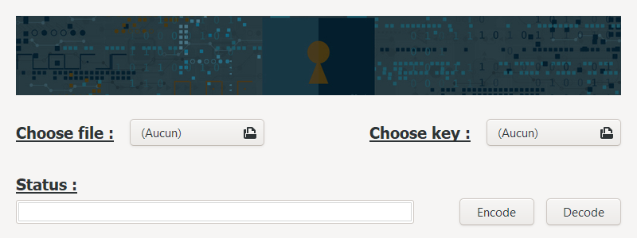
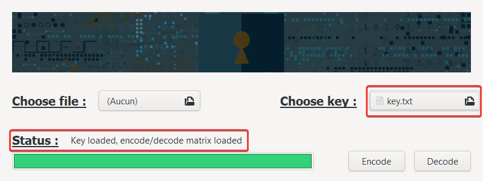
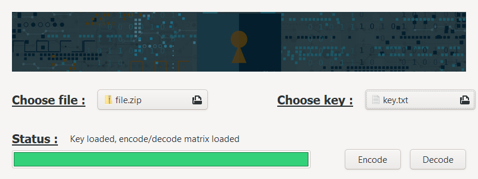
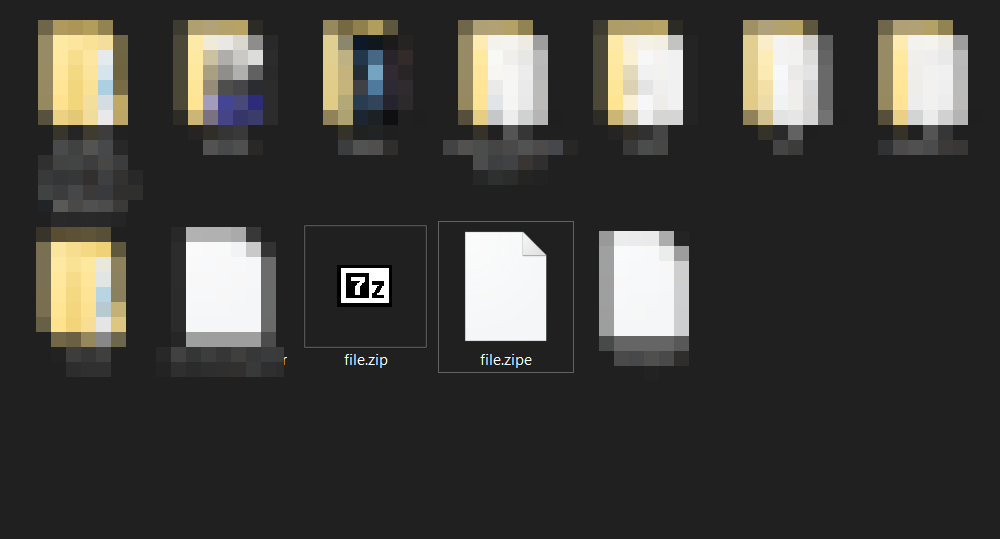
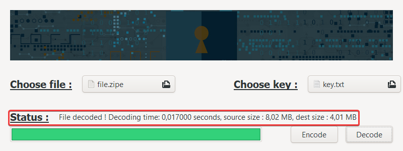
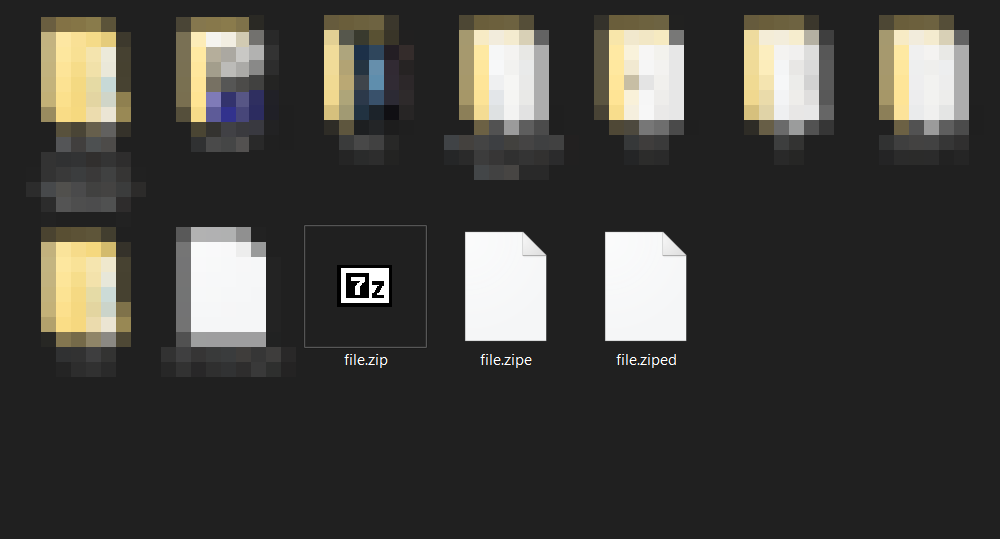

# CODECC

|  |  |  |  |  |
|:------------------------------------------------------------------------:|:------------------------------------------------------------------------:|:------------------------------------------------------------------------:|:--------------------------------------------------------:|:-----------------------------------------------------------------------------:|

> It's CODEC, but in C

## Table of contents

- [Description](#description)
  - [Features](#features)
  - [How it works: the theory](#how-it-works-the-theory)
    - [Encoding](#encoding)
    - [Decoding](#decoding)
- [Usage](#usage)
  - [Load the G4C Matrix](#load-the-g4c-matrix)
  - [Load the file](#load-the-file)
  - [Start the encoding process](#start-the-encoding-process)
  - [Start the decoding process](#start-the-decoding-process)
  - [Warning :warning: :warning: :warning: !!!](#warning----)
    - [Using msys2](#using-msys2-)
- [Code: how the program works](#code-how-the-program-works)
  - [Loading the key](#loading-the-key)
  - [Fill the encoding matrix table](#fill-the-encoding-matrix-table)
  - [Fill the decoding matrix table](#fill-the-decoding-matrix-table)
  - [File encoding process](#file-encoding-process)
  - [File decoding process](#file-decoding-process)
  - [Fixing the cross-compilation issue](#fixing-the-cross-compilation-issue)
- [Contributing](#contributing)
- [Authors](#authors)


## Description

This application is G4C Matrix encryption program developed in C.

### Features

| Feature     | Description                           |
|:------------|:--------------------------------------|
| Encode file | Encode a file with a given G4C Matrix |
| Decode file | Encode a file with a given G4C Matrix |

### How it works: the theory

We will use a G4C encoding matrix (matrix of 4 lines, each containing the value of
one byte expressed with 8 bits) which we will load from a text file in this format:

`G4C=[10001111 11000111 10100100 10010010]`


#### Encoding

We will process the file we want to encode byte per byte by making a
matrix product with our encoding matrix:

- Our matrix: `G4C=[10001111 11000111 10100100 10010010]`
- Our byte: `1010 0101`

First, as we have a 4-line encoding matrix, we separate our byte in two 4-bit parts: `1010` and `0101`.
Then, we make a matrix product: in the program, it is actually a **XOR** between the byte and the matrix.

| Byte / Matrix |               | 1000 1111<br>1100 0111<br>1010 0100<br>1001 0010 |
|:-------------:|:-------------:|:-------------------------------------------------|
|     1010      | :arrow_right: | 0010 1011                                        |
|     0101      | :arrow_right: | 0101 0101                                        |

Result: `10100101` is coded as `00101011 01010101`  
As we see, one input byte generates an output of two encoded bytes: this means that
our encoded output file will be twice bigger than the input source file.

#### Decoding

Since coding a byte leads to getting two encoded byte, the consequence is that we
will need to process the file we want to decode 2 byte per 2 byte in order to
get one decoded byte.

The first step is to find the identity matrix in our G4C matrix columns:

|                                    1234 5678                                     | :arrow_right: |                     5234                     |
|:--------------------------------------------------------------------------------:|:-------------:|:--------------------------------------------:|
| 1**000** **1**111<br>1**100** **0**111<br>1**010** **0**100<br>1**001** **0**010 | :arrow_right: | **1**000<br>0**1**00<br>00**1**0<br>000**1** |

Once we've identified the identity columns, we save their positions: here, it's **(5-2-3-4)**.  
Back to our previously encoded byte that generated these two bytes: `00101011 01010101`.
For each of these two encoded bytes, we will select the bits located at the 5th, 2nd, 3rd and 4th position,
and then concatenate them to get back to a 8-bits decoded byte.

|   1234 5678   | :arrow_right: |   5234   |
|:-------------:|:-------------:|:--------:|
| 0**010 1**011 | :arrow_right: | **1010** |
| 0**101 0**101 | :arrow_right: | **0101** |

And voilà!  
We've just decoded these two bytes and recovered our original one: `1010 0101`


## Usage

The program GUI is pretty simple to understand:



### Load the G4C Matrix

First of all, you need to load your G4C matrix text file.  
:warning: Your key must be in this format: `G4C=[10001111 11000111
10100100 10010010]`, otherwise it won't work.



### Load the file

Then, choose the file you want to encode or decode:




### Start the encoding process

Press the **Encode** button (no kidding! :upside_down_face:).  
The program interface will freeze during the process but don't panic,
it's working.


The encoded file is saved in the same folder than the original one,
and the letter **e** (for "encoded") is added at the end of the file extension.



### Start the decoding process

Press the **Decode** button (haha again, no kidding! :upside_down_face:).  
The program interface will freeze during the process but don't panic,
it's working.



The decoded file is saved in the same folder than the original one,
and the letter **d** (for "decoded") is added at the end of the file extension.



### Warning :warning: :warning: :warning: !!!

In both cases, you will need to have MinGW installed with GTK+3.20 at least.  
I didn't figured out how to compile it in static in all-in-one
executable file yet...

#### Using [msys2](https://www.msys2.org/)

Here's the command to execute inside [msys2](https://www.msys2.org/) to
be able to compile this project:

```bash
pacman -Syu
pacman -S mingw-w64-x86_64-gcc
pacman -S mingw-w64-x86_64-gtk3
```

Then, you need to link the `msys2/mingw64/bin` folder to your `system
environment variable PATH`.

During the build, if some libraries are not found, go to the folder
`msys2/mingw64/include` and copy them outside of the *version folder*:  
**Exemple:** copy **gtk** and **gdk** folder inside
`msys2/mingw64/include/gtk-3-0/` directly inside
`msys2/mingw64/include/`

## Code: how the program works

### Loading the key

First of all, we need to load our key otherwise the program won't start
the encoding / decoding process.  
The key must be in valid format and will be stored in a local array `char
codecKey[4][8]`.

The function `int readKey(const char *path)` in `codecFunction.c` opens the
key text file and first checks the valid format of the key:

```c
int readKey(const char *path) {
     
     ...
    
    char c1[9], c2[9], c3[9], c4[9];
    
    ...
    
    if (fscanf(fp, "G4C=[%[01] %[01] %[01] %[01]]", c1, c2, c3, c4) != 4)
    
    ...
    
    if (strlen(c1) != 8 || strlen(c2) != 8 || strlen(c3) != 8 || strlen(c4) != 8)
```

Then, it stores the key in our `codecKey[4][8]` array:

```c
    for (i = 0; i < 8; ++i) {
        codecKey[0][i] = c1[i] == '1' ? 1 : 0;
        codecKey[1][i] = c2[i] == '1' ? 1 : 0;
        codecKey[2][i] = c3[i] == '1' ? 1 : 0;
        codecKey[3][i] = c4[i] == '1' ? 1 : 0;
    }
    
    ...
    
}
```

### Fill the encoding matrix table

During the encoding process, we don't want to process each byte of the file with the
[encoding](#encoding) method.  
If we think about it, there are only 256 possible values for a byte (0 to 255), and each
input byte will give two encoded bytes in the output: to speed the process,
we will fill a local array `unsigned char encodeMatrix[256][2]` with all the possibilities.  
Then, in our encoding process, we just access the correct index of the
array which is the value of the byte!

The function `int fillMatrixEncode()` in `codecFunction.c` will process the
256 * 2 bytes possibilities depending on the key:

```c
int fillMatrixEncode() {
    char array1[8], array2[8];
    int i, j;
    
    for (i = 0; i < 256; ++i) {
        for (j = 0; j < 8; ++j) {
            array1[j] = (c2b[i][0] && codecKey[0][j]) ^ (c2b[i][1] && codecKey[1][j]) ^ (c2b[i][2] && codecKey[2][j]) ^
                        (c2b[i][3] && codecKey[3][j]);
            array2[j] = (c2b[i][4] && codecKey[0][j]) ^ (c2b[i][5] && codecKey[1][j]) ^ (c2b[i][6] && codecKey[2][j]) ^
                        (c2b[i][7] && codecKey[3][j]);
        }
        encodeMatrix[i][0] = b2C(array1);
        encodeMatrix[i][1] = b2C(array2);
    }
    return 0;
}
```

As we see, we process with a XOR function because a matrix product
between bits is the same as XOR.


### Fill the decoding matrix table

As for the encoding process, we don't want to process each byte of the file with the
[decoding](#decoding) method during the decoding process.  
If we think about it, there are only 256 * 256 possible two-byte combinations: to speed
the process, we fill a local array `unsigned char decodeMatrix[256][256]` with all
the possibilities.  
Then, during the decoding process, we just access the correct index of the first
dimension of the array, which is the value of the first byte, then
the correct index of the second dimension of the array, which is the value of
the second byte!

The function `int fillMatrixDecode()` in `codecFunction.c` will process the
256 * 256 bytes possibilities depending on the key:

```c
int fillMatrixDecode() {
    
    ...
    
    char i4[5], matrixI4[4], byte[8];

    for (i = 0; i < 8; i++) {
        for (j = 0; j < 4; j++) {
            i4[j] = codecKey[j][i];
        }
        i4[4] = '\0';

        if (i4[0] == 1 && i4[1] == 0 && i4[2] == 0 && i4[3] == 0) 
            matrixI4[0] = i;
        else if (i4[0] == 0 && i4[1] == 1 && i4[2] == 0 && i4[3] == 0)
            matrixI4[1] = i;
        else if (i4[0] == 0 && i4[1] == 0 && i4[2] == 1 && i4[3] == 0)
            matrixI4[2] = i;
        else if (i4[0] == 0 && i4[1] == 0 && i4[2] == 0 && i4[3] == 1)
            matrixI4[3] = i;
    }
```

As explained in the [decoding](#decoding) theoretical section, the first step is to find our
identity matrix in our G4C matrix columns. Once we have it, we can
continue:

```c
    for (i = 0; i < 256; i++) {
        for (j = 0; j < 256; j++) {
            for (k = 0; k < 4; k++) {
                byte[k] = c2b[i][matrixI4[k]];
            }
            for (k = 0; k < 4; k++) {
                byte[k + 4] = c2b[j][matrixI4[k]];
            }
            decodeMatrix[i][j] = b2C(byte);
        }
    }
    return 0;
}
```

As we see, we fill our two dimensional array with all the
possibilities, depending on our identity matrix.

### File encoding process

For this part, we will just focus on the part where we read / write
bytes, the rest of the function is just classic file processing.  
The function `int encode()` in `codecFunction.c` will open the source file, create
the encoded destination file and fill it with encoded bytes.  

The treatment is faster if done in memory, so we will use 4
different buffer sizes, depending on the file size (10MB, 1MB, 1KB, 1B).
Each buffer has the same working process so let's see one of them:

```c
int encode() {

    ...
    
        if (size2 >= 10485760) {
        readBufferSize = 10485760;
        writeBufferSize = readBufferSize * 2;
        readBuffer = malloc(readBufferSize);
        writeBuffer = malloc(writeBufferSize);
        while (size2 >= readBufferSize) {
            size2 -= readBufferSize;

            assert(fread(readBuffer, 1, readBufferSize, fp) == readBufferSize);

            pthread_create(threads, NULL, worker1, NULL);
            pthread_create(threads + 1, NULL, worker2, NULL);

            pthread_join(threads[0], NULL);
            pthread_join(threads[1], NULL);

            assert(fwrite(writeBuffer, 1, writeBufferSize, dest) == writeBufferSize);
        }

    }
```

When initialized, `size2` is the size of the source file and will be decremented
every time we process the file: this allows us to know how many bytes are left
to process. The `readBuffer` array contains the bytes we read from the source
file, and the `writeBuffer` array will contain the encoded bytes: as a source byte
generates two encoded bytes, it will be twice bigger as the `readBuffer` size.

To fill `writeBuffer`, we use two threads: the first one fills the `writeBuffer`
array with the first encoded byte, and the second one fills it with the second
encoded byte.
Each of these threads calls a `worker` function:

```c
void *worker1() {
    for (int i = 0; i < readBufferSize; ++i) {
        writeBuffer[i * 2] = encodeMatrix[readBuffer[i]][0];
    }
    return (NULL);
}

void *worker2() {
    for (int i = 0; i < readBufferSize; ++i) {
        writeBuffer[i * 2 + 1] = encodeMatrix[readBuffer[i]][1];
    }
    return (NULL);
}
```

Once all of the bytes are processed, we just free the buffers and close the source and
destination files.


### File decoding process

As for the file encoding process, we will just focus on the part where we read / write
bytes, the rest of the function is just classic file processing.  
The function `int decode()` in `codecFunction.c` will open the encoded source file,
create the decoded destination file and fill it with decoded bytes.  

Once again, the treatment is faster when done in memory, so we will use 4
different buffer sizes, depending on the file size (20MB, 2MB, 2KB, 2B: these values
are twice bigger as the encoding buffer sizes since two encoded bytes are
necessary to get a decoded byte).

Each buffer has the same working process so let's see one of them:

```c
    if (size2 > 20971520) {
        readBufferSize = 20971520;
        writeBufferSize = readBufferSize / 2;
        readBuffer = realloc(readBuffer, readBufferSize);
        writeBuffer = realloc(writeBuffer, writeBufferSize);
        while (size2 >= readBufferSize) {
            size2 -= readBufferSize;

            assert(fread(readBuffer, 1, readBufferSize, fp) == readBufferSize);

            for (i = 0; i < writeBufferSize; i++) {
                writeBuffer[i] = decodeMatrix[readBuffer[i * 2]][readBuffer[i * 2 + 1]];
            }

            assert(fwrite(writeBuffer, 1, writeBufferSize, dest) == writeBufferSize);
        }
    }
```

When initialized, `size2` is the size of the source file and will be decremented
every time we process the file: this allows us to know how many bytes are left
to process. The `readBuffer` array contains the bytes we read from the source
file, and the `writeBuffer` array will contain the decoded bytes: it will be 
half the size of `readBuffer`.  

To fill `writeBuffer`, we just read the `readBuffer` bytes two by two and use
them as index of our `decodeMatrix`.

Once all of the bytes are processed, we just free the buffers and close the source and
destination files.

### Fixing the cross-compilation issue

If we want to compile on both Linux and Windows, we have an issue
with the `fseek()` and `ftell()` functions that are used to determine the size
of the source file.

Indeed, on Windows, `ftell()` only returns and `int` type value: if the
source file size is higher than `2 147 483 647 bytes` (`~ 2.14 GB`), it
will return `-1` on `size_t size`, which is `unsigned` type.  This problem is not
present on Linux because `ftell()` returns a `long` type value, which is enough.  


To fix this problem on Windows, we can use the `_fseeki64()` and `_ftelli64()`
functions from MinGW that return a `long long` type value, but these
functions are not available on Linux. 

 
The solution is to use a compilation macro to determine the system that is running the 
program and which functions should be used:

```c
#ifdef _WIN64
    assert(!_fseeki64(fp, 0, SEEK_END));
    size_t size = _ftelli64(fp);
    assert(!_fseeki64(fp, 0, SEEK_SET));
#elif __linux__
    assert(!fseek(fp, 0, SEEK_END));
    size_t size = ftell(fp);
    assert(!fseek(fp, 0, SEEK_SET));
#else
    #error You need to compile on Linux or Windows 64bits
#endif
```

## Contributing

If someone has an idea on how to compile in static with GTK or
stuffs to be dependence free, be my guest!

## Authors

This project was carried out by myself :sunglasses:.

| [Noé LARRIEU-LACOSTE](https://github.com/Nouuu) |  |
|:------------------------------------------------|:--------------------------------------------------:|

